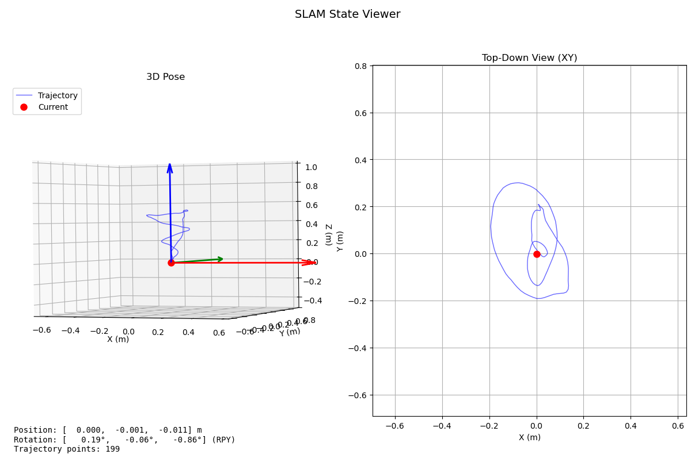
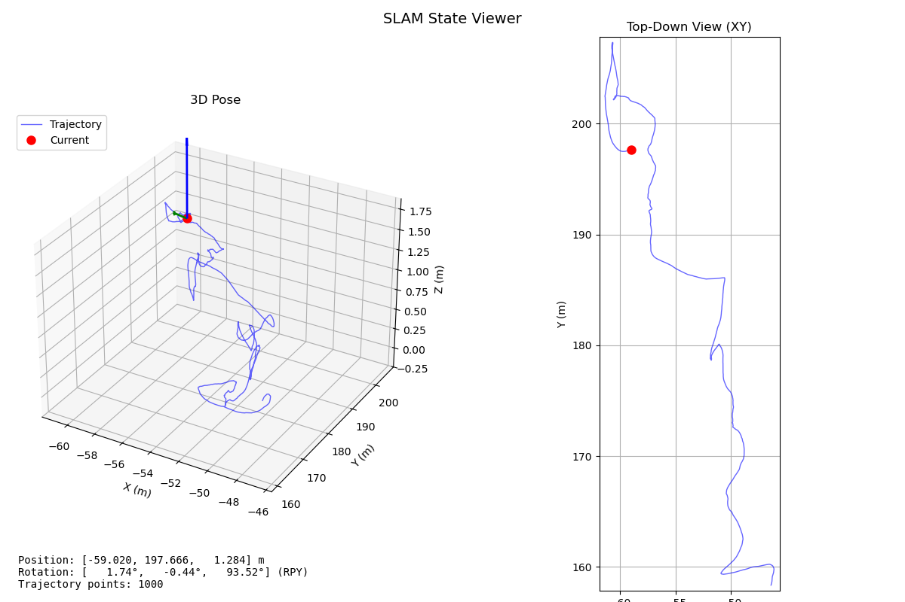

# rust_lio

under construction, specified for Livox MID360

runs well in handheld mode

Benchmark test on dataset [livox_loop_2025-02-06-18-24-40](https://rdm.inesctec.pt/dataset/nis-2025-001) failed with severe drift

## Known Issues

 - Gravity estimate, current code assumes IMU is roughly level during initialization.
 - Dynamic objects are not handled yet.
